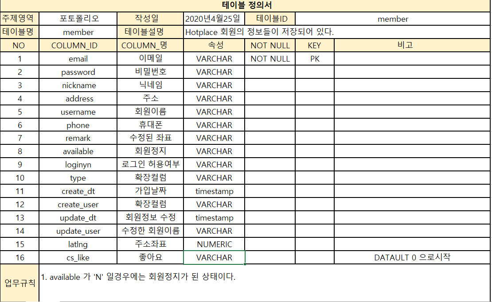
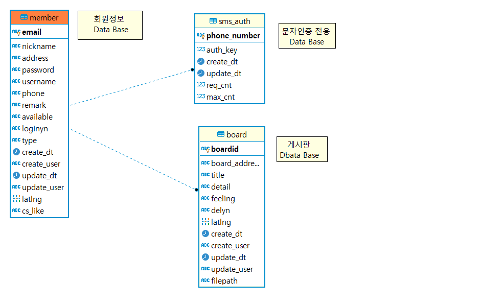
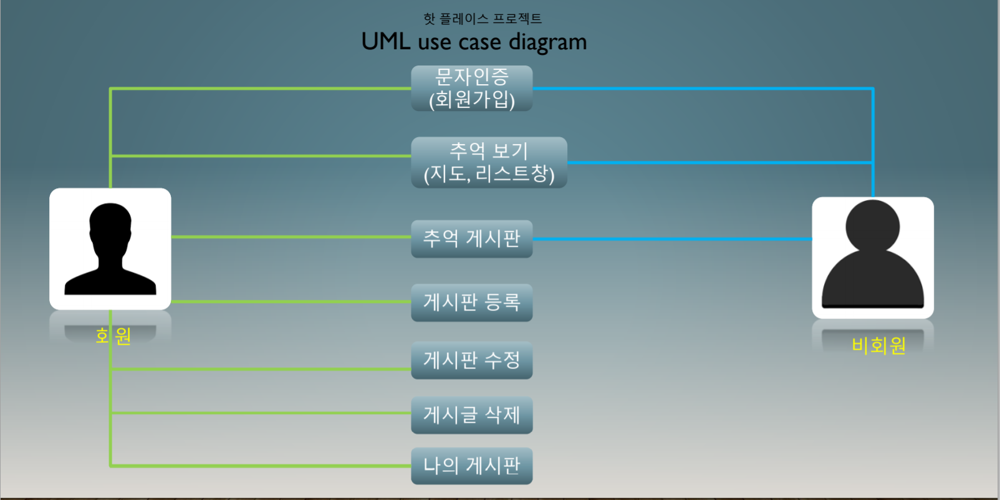

# 개요
● 프로젝트명 : Hotplace

● 일정 : 2020.4.25 ~ 2020.5.25

● 팀구성 : 유영규

● 목적 : API에 대한 이해도와 지인분께서 고객의 입장으로 요청으로 인해 시작된 프로젝트 
        ○ 고객의 요청을 최대한 수용해서 만들려고하는 실력을 기르기위함에 중점
        ○ API에대한 이해도를 향상시키기 위한 목적

 ● 사용기술 및 개발환경
        ○ O/S : Windows 10(개발환경)       
        ○ Server : Tomcat8.5
        ○ DB : PostgreSQL
        ○ Pramework : Spring boot, Jquery, mybatis
        ○ Programming Language : JAVA, HTML, Javascript, CSS
        ○ Tool : Eclipse

# 목적
● 카카오맵 API를 사용함으로써 API 분석능력을 기르는 목적

● 특정지역에서 느낀 감정 및 사진들을 모두와 공유하고자 하는 목적에서 생겨난 프로젝트 

# 기획
● Hotplace 회원이 추억게시글을 업로드하고 작성한 추억게시글을 비회원 회원 모두가 볼 수 있도록 구현

# 프로젝트 주요 기능
● 회원가입 및 로그인, 로그아웃

● 회원가입시 문자인증 및 주소입력 

● 게시글 작성 , 수정 ,삭제 

● 카카오맵 API 활용 

● 추억게시글을 등록시 입력한 주소에 인포윈도우 표시

● 지도에 보이는만 추억리스트에 보이기 ( 지도움직일떄마다 수시로 업로드 )

● 등록한 게시글을 특정 키워드로 검색하는 기능

# 사용 기술
● Spring boot, MyBatis, java, javascript, jquery, PostgreSQL

# 기술적인 집중 요소 
● 객체지향의 기본 원리와 spring boot의 MVC 패턴이해

● spring boot의 확장성있는 코드

● javascript 및 jquery 의 이해

# 기술적인 문제해결 과정
● 미숙한 활용방법으로 인해 구글링과 여러방법으로 시도함으로써 알맞은 방법으로 해결해나감.

# 테이블 정의서

# DBdiagrame

# USECASE 

● 회원 : 
        자신의 추억게시글 작성을 할 수 있다.
        작성한 게시글을 수정or삭제 할 수 있는 기능

● 비회원 :
       회원들이 작성한 추억게시글을 관람 가능하다.
       카카오맵에서와 추억리스트에서 관람 가능.